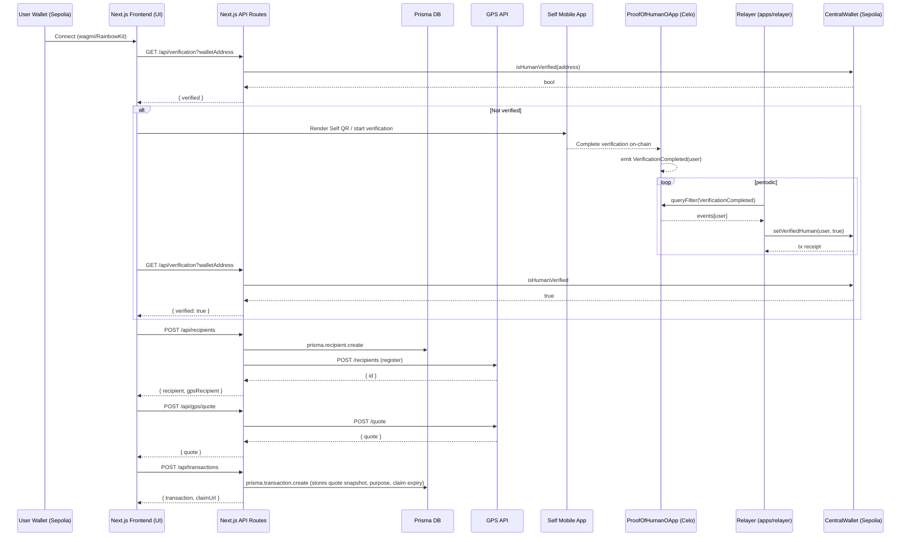

# GlobalX Money Monorepo

A decentralized system which enables users to make cross-border payouts using stablecoin(PyUSD), secured by on-chain and off-chain ZK proofs powered by Self. It provides a simple interface to create payouts, manage recipients and ensures that the recipient is verified before the payouts actually happen, making it a secure and AML-compliant system.

### End-to-end sequence



## Product Overview (Non‑Technical)
GlobalX Money enables individuals and small businesses to send compliant, near‑instant international payouts with full transparency on FX rates, identity verification and settlement status. The experience is designed to feel like a modern consumer money app while meeting the guardrails regulators and banking partners expect.

### Core Value Proposition
| Stakeholder | Value |
|-------------|-------|
| Sender (User) | Fast quote, locked rate, clear fees, instant INR delivery. |
| Recipient | Reliable bank payout, optional claim link flow. |
| Compliance / Ops | Deterministic KYC gate (on‑chain verification), audit trail of quote + execution snapshot. |
| Engineering | Modular architecture (frontend, relayer, contracts, data) for faster iteration. |

### Why On‑Chain Verification?
Traditional KYC duplicates checks across providers. By anchoring a verification outcome on-chain (Self Protocol) we:
- Reduce repeated friction for returning users
- Provide cryptographic auditability
- Allow future interoperability with other regulated dApps

### User Personas
1. Solo Freelancer (exports digital services, wants predictable FX and fast payout to family / vendors in India).
2. Startup Ops Manager (needs to fund recurring contractor payments with clear compliance status).
3. Recipient (passive) – simply receives funds in bank; optionally views a claim link.
4. Compliance Analyst – monitors verification & funding thresholds.

### Typical User Journey
1. Connect wallet → get quote (sees transparent FX + no hidden fees)
2. Verify identity (one‑time) via Self app QR
3. Fund settlement balance (approve + deposit PYUSD test token)
4. Add or select recipient (bank details)
5. Enter purpose & description (compliance metadata)
6. Confirm & execute → payout intent stored, funds earmarked
7. (Optional) Share claim link with recipient for acknowledgement

### Differentiators
- On‑chain portable verification (vs siloed KYC)
- Live rate with clear delta vs mid‑market
- Zero fee messaging and instant payout positioning (<10s target)
- Claim URL pattern (future extensibility for recipient self‑service)

## Non‑Technical Data Flow (Narrative)
"You" connect a wallet, the app checks if you are verified. If not, you scan a QR in the Self mobile app which proves—without sharing full personal data again—that you meet age / geography rules. A lightweight relayer watches the public verification event and updates an allow‑list flag on the settlement contract on another chain. Once verified, you deposit a stable token into a shared settlement contract, and then you can initiate a payout by specifying who should receive funds and why. The system stores a snapshot of the FX rate you accepted so any later audits can reconstruct exactly what you saw.

## Compliance & Risk (High Level)
- Identity gating before funding or execution
- Explicit purpose + description stored per transaction
- Separation of quoting (read) vs state change (write) surfaces
- Deterministic chain IDs & contract addresses reduce mis‑routing risk

## Roadmap Themes (Business)
- Coverage: More corridors & settlement assets
- Trust: Proof-of-reserve style dashboard for contract balances
- Ops: Automated anomaly alerts (failed relays, stale verification)
- UX: Recipient self‑service portal & payout tracking

## Packages / Apps

| Path | Description |
|------|-------------|
| `apps/client` | Next.js 15 (App Router) frontend: quote, KYC trigger, funding, payout flow. |
| `apps/relayer` | Node/Express relayer syncing Self Protocol verification from Celo to Sepolia CentralWallet. |
| `apps/contracts` | Solidity contracts: `CentralWallet` (Sepolia; deposits & KYC gate) and `ProofOfHumanOApp` (Celo; emits verification events). |
| `prisma` (under client) | Prisma schema & migrations for recipients, transactions, verification records. |

## Key Functional Domains

### 1. Wallet & Chain Management
- Uses `wagmi` + `@rainbow-me/rainbowkit` to connect EVM wallets.
- Forces Sepolia for settlement token (PYUSD test version).
- Auto attempts network switch; user guided if denied.

### 2. Identity Verification (Self Protocol)
- User triggers verification: QR rendered via `@selfxyz/qrcode`.
- Frontend builds a `SelfApp` via `SelfAppBuilder` (scope, age, excluded countries).
- Relayer listens to Celo ProofOfHumanOApp events and reflects status to CentralWallet.
- Frontend checks `/api/verification?walletAddress=0x...` to gate actions (deposit / execute).

### 3. Funding (Settlement Balance)
- User approves PYUSD token allowance to CentralWallet.
- Then calls `depositPYUSD(amount)` on CentralWallet.
- UI auto-chains approval → deposit if not approved (optimistic flow).
- Display of masked contract/token addresses & partial amount shortcuts.

### 4. FX Quoting & Payout Intent
- User selects asset (currently PYUSD activated) and enters amount (send or receive side).
- App periodically refetches quote every 60s with countdown.
- Creates a payout transaction intent via `/api/transactions` storing a snapshot of quote.
- If a claim-based flow is used, a `claimUrl` is returned for recipient-side confirmation.

### 5. Recipient Management
- Multi-step form (profile → contact → bank). Validation per step.
- Stored per wallet address, enabling reuse for future transfers.
- Normalization merges GPS / internal recipient IDs.

### 6. Relayer Service
- Polls Celo events every N seconds (configurable `RELAYER_INTERVAL_MS`).
- On new verification events, writes status to Sepolia CentralWallet contract.
- Exposes health/status endpoints for ops visibility.

## Tech Stack
- Frontend: Next.js 15 (App Router), React 19, Tailwind CSS, Radix UI, React Query.
- Web3: wagmi v2, viem, ethers (relayer), RainbowKit, Self Protocol SDKs.
- Backend (API routes): Node (Edge/Server runtime depending on route needs).
- Data: Prisma ORM (SQLite locally or Postgres in deployment). Migrations under `apps/client/prisma`.
- Monorepo tooling: Turbo, npm workspaces.

## Environment Variables (Client)
Create `apps/client/.env`:
```
NEXT_PUBLIC_CENTRAL_WALLET_ADDRESS=0x...
NEXT_PUBLIC_PYUSD_TOKEN_ADDRESS=0x...
DATABASE_URL=file:./dev.db
SELF_API_KEY=... (if required for extended features)
```

(Adjust according to actual constants. Contract addresses also surfaced in `lib/constants.js`.)

## Environment Variables (Relayer)
```
ETHERSCAN_API_KEY=your_etherscan_api_key
PROOF_OF_HUMAN_CONTRACT=0x...
CENTRAL_WALLET_CONTRACT=0x...
CELO_RPC=https://forno.celo.org
SEPOLIA_RPC=https://eth-sepolia.g.alchemy.com/v2/yourKey
RELAYER_PRIVATE_KEY=0x...
RELAYER_INTERVAL_MS=10000
PORT=8001
HOST=0.0.0.0
```

## Local Development
```bash
# Install deps (root)
npm install

# Run all apps (client + relayer)
npm run dev  # or: turbo run dev

# Client only (Next.js)
cd apps/client && npm run dev

# Relayer only
cd apps/relayer && npm run dev
```

Visit: `http://localhost:3000` (client) and `http://localhost:8001` (relayer status page)

## Prisma & Database
```bash
# Generate client
turbo run prisma:generate --filter=globalx-money-client # if a script exists
# Run migrations (example)
npx prisma migrate dev --schema=apps/client/prisma/schema.prisma
```
Adjust commands to the actual scripts you define.

## Contract Interactions
| Contract | Network | Purpose |
|----------|---------|---------|
| [CentralWallet](https://sepolia.etherscan.io/address/0xbe04d187db8d3dc61aeb5ae3ff2711371d7e307c) | Sepolia | Holds user deposits (PYUSD) & KYC gating. |
| [ProofOfHumanOApp](https://celoscan.io/address/0xbE04D187dB8D3DC61AEB5AE3FF2711371D7E307c) | Celo Mainnet | Emits verification events for Self Protocol. |
| [PYUSD (test)](0xCaC524BcA292aaade2DF8A05cC58F0a65B1B3bB9) | Sepolia | Settlement token for funding & payouts. |

## Security Considerations
- Never commit private keys (`RELAYER_PRIVATE_KEY`). Use environment secrets.
- Validate user inputs server-side on `/api/*` routes.
- Limit chain switching auto-attempt loops (implemented via ref guard).
- Consider rate limiting for transaction & recipient creation endpoints.

## Production Deployment
- Deploy `apps/client` to Vercel (supports App Router & Edge functions).
- Deploy `apps/relayer` to a Node host / container (Docker recommended) with secure env variables.
- Use a managed Postgres instance; update `DATABASE_URL`.
- Set up monitoring for relayer health endpoints.

## Future Enhancements
- Add multi-asset settlement (activate other currencies in `fundingAssets`).
- Implement withdrawal flow from CentralWallet.
- Add recipient verification / sanctions screening provider integration.
- Expand claim URL flow to recipient self-service portal.
- Introduce email/webhook notifications on deposit & payout execution.

## Monorepo Scripts (Example Suggestions)
Add to root `package.json` if not present:
```json
{
  "scripts": {
    "dev": "turbo run dev",
    "build": "turbo run build",
    "lint": "turbo run lint",
    "typecheck": "turbo run typecheck"
  }
}
```

## Folder Overview
```
apps/
  client/
    app/                 # Next.js app router pages & routes
    lib/                 # Constants, web3 config (wagmi, prisma)
    components/          # UI + flow components
    prisma/              # Prisma schema & migrations
    public/              # Static assets
  relayer/
    services/            # Blockchain + sync logic
    abis/                # Contract ABIs
    routes.js            # Express route definitions
    views/               # HTML status / error pages
```

## Contributing
1. Fork & branch (feat/your-feature)
2. Commit with clear messages
3. Open PR with context & screenshots if UI changes

## License
ISC (adjust if needed)


## Glossary
| Term | Meaning |
|------|---------|
| Settlement Balance | Pre‑funded token amount available for payouts |
| Verification | On‑chain status indicating KYC / eligibility passed |
| Quote Snapshot | Stored FX data & expiry used when creating a payout intent |
| Claim URL | Shareable link enabling recipient or third party acknowledgement |
| Relayer | Service bridging verification state across chains |

## FAQ (Non‑Technical)
**Q: Why do I need to verify before depositing?**  
To ensure funds originate from a verified entity, simplifying downstream compliance.  
**Q: Can I withdraw my settlement balance?**  
Withdrawal flow is planned (see roadmap).  
**Q: What if the FX rate changes mid‑flow?**  
Rate auto‑refreshes; snapshot locks what you accepted at confirmation.  
**Q: Is my personal data stored on chain?**  
No — only a verification proof/status, not raw identity attributes.

## KPIs to Track (Suggested)
- Verification conversion rate
- Time from quote → execute
- Funding approval→deposit success ratio
- Quote refresh latency & slippage vs mid‑market
- Relayer synchronization lag

## Pitch (One Liner)
Borderless payouts with instant compliance—verify once, move value globally in seconds.

---
Built with care for secure, instant cross‑border payouts.

---
